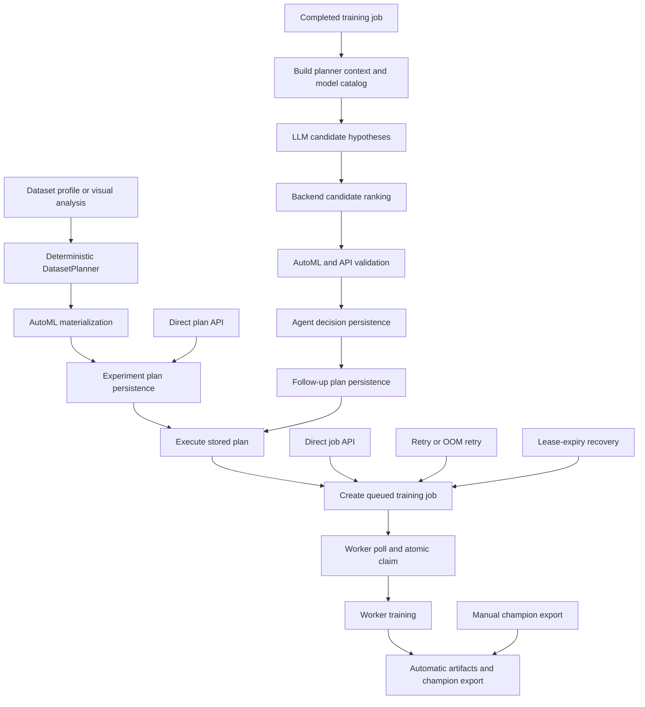

# User-configurable exclusions for AI experiment proposals and runs

Status: architecture and implementation plan; no implementation included  
Repository revision inspected: `1d077e2`  
Inspection date: 2026-07-11

## Executive recommendation

Model Express should use two complementary policy layers:

1. A **versioned, closed-world compatibility profile** that defines the capabilities an integration supports. Roasty's first profile should permit only the explicitly supported FP32 image-classification ONNX surface.
2. A **user deny overlay** that can remove additional capabilities at account, project, dataset, or individual-run scope.

The effective permitted catalog is:

```text
platform-supported capabilities
    INTERSECT every inherited compatibility-profile allowlist
    MINUS the union of every inherited explicit denial
```

An explicit denial always wins. More specific scopes may add restrictions but may not re-enable something denied by a broader scope. Every proposal and lifecycle operation must pass the same deterministic server-side policy evaluator. Filtering the AI prompt is necessary for proposal quality, but is not a security or correctness boundary.

Existing installations with no policy should resolve to an implicit `allow_all_v0` profile and retain current behavior. A closed-world profile such as `roasty_v1` must reject newly added catalog options until a new profile version explicitly allows them.

## Required invariants

- AI proposals are generated from the effective permitted catalog, not from the full catalog plus prose warnings.
- The server validates the canonical requested configuration and its effective semantics before persistence or scheduling.
- Explicit denial wins over profiles, defaults, aliases, inferred values, and more specific scope settings.
- Clone-by-copy, retry, rerun, direct API creation, templates, exports, lease recovery, and queued-job dispatch use the current policy.
- Policy updates cannot be bypassed by a job that was queued under an older policy.
- Unknown catalog identifiers, aliases, defaults, presets, and worker fallbacks fail closed when a restrictive profile is active.
- If policy leaves no valid configuration, Model Express returns an actionable structured error and never silently relaxes policy.
- Every evaluation records the catalog version, policy sources, effective-policy hash, decision, and stable reason codes.
- Policy rules are data-driven and operate on stable catalog identifiers rather than scattered field-specific conditionals.

## Current proposal-to-run architecture



The major paths are described below.

### Deterministic initial proposals

Dataset profiling can trigger initial plan creation in [`datasets.go`](../../services/orchestrator/internal/api/datasets.go#L328-L360), and accepted visual analysis can do the same in [`visual_analysis.go`](../../services/orchestrator/internal/api/visual_analysis.go#L376-L380).

[`createInitialPlanForDataset`](../../services/orchestrator/internal/api/plans.go#L87-L154) calls the deterministic `DatasetPlanner`, applies AutoML preparation, persists the plan, and may execute it automatically. Its hard-coded classifier and detector proposals live in [`planner.go`](../../services/orchestrator/internal/agents/planner.go#L41-L221). This path does not depend on an AI prompt and therefore bypasses prompt-only exclusions.

### Direct plan creation

`POST /projects/:id/plans` is registered in [`router.go`](../../services/orchestrator/internal/api/router.go#L141). [`createExperimentPlan`](../../services/orchestrator/internal/api/plans.go#L691-L768) accepts caller-supplied experiments or invokes the deterministic planner, applies AutoML preparation, validates experiment fields, and persists the plan. Dataset/task compatibility is deferred until execution.

### LLM follow-up proposals

Completed training jobs enter the follow-up loop in [`agent_followups.go`](../../services/orchestrator/internal/api/agent_followups.go#L1135-L1221). [`runExperimentPlannerAfterTrainingJob`](../../services/orchestrator/internal/api/agent_runtime.go#L390-L547) builds planner input from prior plans, jobs, metrics, memories, and the model catalog. The catalog is attached in [`agent_runtime.go`](../../services/orchestrator/internal/api/agent_runtime.go#L563-L713).

The LLM prompt and its currently hard-coded technique vocabularies are assembled in [`experiment_planner_llm.go`](../../services/orchestrator/internal/agents/experiment_planner_llm.go#L978-L1255). JSON generation and decoding occur in the same module at [`experiment_planner_llm.go`](../../services/orchestrator/internal/agents/experiment_planner_llm.go#L844-L902).

For `ADD_EXPERIMENTS`, the backend does not trust the draft experiments directly. [`FinalizePlannerRecommendation`](../../services/orchestrator/internal/agents/candidate_ranking.go#L18-L155) ranks candidate hypotheses and builds selected experiments. The current ranking gate checks shape, mechanism, novelty, memory, and scoring, but not a user policy; see [`candidate_ranking.go`](../../services/orchestrator/internal/agents/candidate_ranking.go#L248-L374).

The API then runs AutoML and backend validation/retry in [`agent_runtime.go`](../../services/orchestrator/internal/api/agent_runtime.go#L818-L927). [`experimentPlannerDecisionPayload`](../../services/orchestrator/internal/api/agent_runtime.go#L1285-L1379) revalidates selected experiments and dataset compatibility before the agent decision is persisted. Autonomous mode schedules the decision afterward.

### Follow-up plan creation

[`ensureFollowUpPlan`](../../services/orchestrator/internal/api/agent_followups.go#L386-L537) reparses a stored decision, attaches mechanisms, applies AutoML, validates experiments, checks dataset compatibility and novelty, and persists or reuses a follow-up plan. Automatic execution is handled in [`agent_followups.go`](../../services/orchestrator/internal/api/agent_followups.go#L936-L963).

### Plan execution and worker dispatch

`POST /plans/:id/execute` is registered in [`router.go`](../../services/orchestrator/internal/api/router.go#L144). [`executeStoredExperimentPlan`](../../services/orchestrator/internal/api/plans.go#L157-L381) checks dataset compatibility, resolves an execution spec, validates execution fidelity, creates a queued job, and creates or updates worker demand.

Workers poll through [`workers.go`](../../services/orchestrator/internal/api/workers.go#L897-L923). PostgreSQL selects and assigns a matching queued job transactionally in [`postgres_job_records.go`](../../services/orchestrator/internal/store/postgres_job_records.go#L19-L194). Current matching considers queue state, project, provider, and template, not the current experiment policy.

## Where options are registered today

### Models and model metadata

The principal server model catalog is hard-coded in [`plan_validation.go`](../../services/orchestrator/internal/api/plan_validation.go#L20-L106). The catalog contains these stable-looking model IDs:

Image classification:

- `mobilenet_v3_small`
- `mobilenet_v3_large`
- `efficientnet_b0`
- `regnet_y_400mf`
- `efficientnet_b1`
- `efficientnet_b2`
- `resnet18`
- `resnet34`
- `convnext_tiny`
- `swin_t`
- `vit_b_16`

Object detection:

- `yolo11n.pt`
- `yolo11s.pt`
- `yolo11m.pt`
- `yolo11l.pt`
- `yolo11x.pt`

Each record also carries family, task, deployment tier, latency class, and supported fine-tuning modes. The record type is [`SupportedModelSpec`](../../services/orchestrator/internal/agents/objective.go#L12-L25).

Model registration is duplicated in worker construction code in [`modal_app.py`](../../services/worker/worker/training/modal_app.py#L3422-L3501) and [`champion_jobs.py`](../../services/worker/worker/champion_jobs.py#L756-L840). Unknown classifier values can currently fall through to MobileNet V3 Small in worker code. That fallback must become an error once canonical policy enforcement exists; otherwise a forged or stale job can execute a different model than the audited one.

The deterministic planner duplicates model choices in [`planner.go`](../../services/orchestrator/internal/agents/planner.go#L115-L220), and approximate model-size/latency information is separately hard-coded in the local simulator in [`local.py`](../../services/worker/worker/training/local.py#L547-L605). Model-size estimates are not currently a stable catalog dimension.

### Task, runner, preprocessing, and training options

The best existing canonical source is [`contracts/experiment_execution_capabilities.v1.json`](../../contracts/experiment_execution_capabilities.v1.json#L1). It defines task/runner support, field types, fixed semantics, defaults, ranges, allowed values, and aliases. Current tasks are `image_classification` and `object_detection`; current runners are `local_simulator`, `modal_torchvision`, and `modal_ultralytics`.

Current canonical preprocessing IDs include:

- Resize: `squash`, `preserve_aspect_pad`, `center_crop`, `random_resized_crop`, `bbox_crop_if_available`, `yolo_letterbox`.
- Crop: `none`, `center_crop`, `random_resized_crop`, `bbox_crop_if_available`, `bbox_crop_ablation`.
- Normalization: `imagenet`, `dataset`, `none`.
- Bounding-box mode: `ignore`, `crop_if_available`, `crop_and_compare_full_image`, `use_boxes_as_metadata`.
- Augmentation policies: `none`, `light`, `moderate`, `strong`, `custom`, `basic`, `randaugment`, `trivialaugment`, `autoaugment`, `mixup`, `cutmix`.
- Individual augmentation operations: `horizontal_flip`, `vertical_flip`, `color_jitter`, `random_crop`, `random_rotation`, `random_erasing`.

The contract is generated into Go and Python by [`generate_experiment_execution_capabilities.py`](../../scripts/generate_experiment_execution_capabilities.py#L13-L131):

- [`capabilities_generated.go`](../../services/orchestrator/internal/execution/capabilities_generated.go)
- [`execution_capabilities_generated.py`](../../services/worker/worker/training/execution_capabilities_generated.py)

Actual classifier preprocessing is also separately registered in [`preprocessing_registry.py`](../../services/worker/worker/training/preprocessing_registry.py#L17-L137). The worker's augmentation semantics are in [`augmentation.py`](../../services/worker/worker/training/augmentation.py#L3-L117). Presets imply individual operations:

| Policy | Implied operations |
|---|---|
| `light` | horizontal flip |
| `moderate` | horizontal flip, color jitter, random crop |
| `strong` | horizontal flip, color jitter, random crop, rotation, erasing |
| `basic` | horizontal flip |

Policy evaluation therefore needs implication closure. For example, denying `random_erasing` must also make `strong` unavailable. Similarly, `use_dataset_normalization=true` is semantically equivalent to `normalization_strategy=dataset` in worker behavior.

### Aliases

Aliases are declared in the execution-capabilities contract and normalized in [`capabilities.go`](../../services/orchestrator/internal/execution/capabilities.go#L331-L355). Examples include:

- `letterbox` → `yolo_letterbox`
- `auto_augment` → `autoaugment`
- `rand_augment` → `randaugment`
- `trivial_augment`, `trivial_augment_wide`, and `trivialaugmentwide` → `trivialaugment`

Provider aliases are separately normalized in [`workers.go`](../../services/orchestrator/internal/api/workers.go#L553-L564). Policies must be stored and compared using canonical IDs. The submitted alias may be retained only as audit evidence.

### Export formats, precision, and runtimes

Export formats are currently duplicated in [`champion.go`](../../services/orchestrator/internal/api/champion.go#L1628-L1638) and [`champion_jobs.py`](../../services/worker/worker/champion_jobs.py#L31-L42):

- `onnx`
- `torchscript`
- `pytorch`
- `safetensors`

Real classification training automatically creates ONNX, TorchScript, and framework-native/PyTorch artifacts in [`modal_app.py`](../../services/worker/worker/training/modal_app.py#L4438-L4468). An ONNX-only policy must therefore control worker artifact production, not just the manual champion-export endpoint.

YOLO training attempts ONNX export and can fall back to a PyTorch artifact in [`modal_yolo.py`](../../services/worker/worker/training/modal_yolo.py#L887-L912). A restrictive ONNX-only policy must turn that situation into an actionable export failure instead of producing a forbidden fallback.

There is no current proposal/catalog option for precision or quantization. Classification ONNX export uses a float32 dummy input and opset 18 in [`artifacts.py`](../../services/worker/worker/exporting/artifacts.py#L391-L426). YOLO uses opset 12. ONNX Runtime inference currently specifies `CPUExecutionProvider` in [`inference.py`](../../services/worker/worker/exporting/inference.py#L186-L220) and [`inference.py`](../../services/worker/worker/exporting/inference.py#L298-L317).

Training providers (`local`, `modal`, and `persistent_gpu`) are not inference execution providers. Precision, quantization, deployment runtime, execution provider, and runtime requirements need first-class catalog categories rather than inference from training-provider names.

## Why prompt-only exclusion is insufficient

| Bypass path | Current evidence | Required policy check |
|---|---|---|
| Deterministic initial planner | [`planner.go`](../../services/orchestrator/internal/agents/planner.go#L41-L221) | Before candidate construction and before plan persistence |
| Deterministic reviewer/fallback | [`reviewer.go`](../../services/orchestrator/internal/agents/reviewer.go#L32-L143) and hard-coded proposals at [`reviewer.go`](../../services/orchestrator/internal/agents/reviewer.go#L329-L430) | Before proposal return and again before persistence |
| Direct plan API / clone-by-copy | [`plans.go`](../../services/orchestrator/internal/api/plans.go#L691-L768) | Post-AutoML, pre-persistence |
| Stored plans after policy changes | [`plans.go`](../../services/orchestrator/internal/api/plans.go#L157-L381) | Re-evaluate current policy on every execute |
| Direct training-job API | [`jobs.go`](../../services/orchestrator/internal/api/jobs.go#L1868-L1975) | Validate canonical train/export intent before job insert |
| Developer UI arbitrary job JSON | [`App.tsx`](../../apps/mission-control/src/App.tsx#L2069-L2086) | Server-authoritative validation; UI preview only |
| AutoML materialization | [`automl.go`](../../services/orchestrator/internal/api/automl.go) | Evaluate the concrete post-AutoML configuration |
| Retry and OOM mutation | [`jobs.go`](../../services/orchestrator/internal/api/jobs.go#L610-L680) and [`jobs.go`](../../services/orchestrator/internal/api/jobs.go#L874-L950) | Re-evaluate mutated configuration under current policy |
| Store retry | [`postgres_jobs.go`](../../services/orchestrator/internal/store/postgres_jobs.go#L20-L90) | Route through service policy gate; store invariant for bound evaluation |
| Lease-expiry requeue | [`postgres_job_records.go`](../../services/orchestrator/internal/store/postgres_job_records.go#L420-L495) | Mark policy-pending and revalidate before claim |
| Queued-job dispatch | [`postgres_job_records.go`](../../services/orchestrator/internal/store/postgres_job_records.go#L19-L194) | Atomic current-policy check immediately before assignment |
| Manual champion export | [`champion.go`](../../services/orchestrator/internal/api/champion.go#L595-L726) | Before export record and job creation |
| Automatic champion export | [`champion.go`](../../services/orchestrator/internal/api/champion.go#L268-L302) | Same gate as manual export |
| Automatic worker artifacts | [`modal_app.py`](../../services/worker/worker/training/modal_app.py#L4438-L4468) | Signed/versioned artifact plan plus worker defense in depth |

There are no first-class clone, saved-template, or user-facing rerun routes today. Reposting an existing plan/job acts as clone-by-copy, and executing a plan again recreates failed jobs. Future clone, template, and rerun endpoints must call the same central evaluator rather than add path-specific checks.

## Recommended canonical catalog

Add a versioned master identity catalog:

```text
contracts/model_express_catalog.v1.json
```

Keep `experiment_execution_capabilities.v1.json` focused on task/runner execution semantics, but require all referenced IDs to exist in the master catalog. Generate Go, Python, and TypeScript representations from the master file and test them for exact parity.

Recommended categories:

- `tasks`
- `models`
- `model_families`
- `deployment_tiers`
- `latency_tiers`
- `model_size_tiers`
- `fine_tuning_modes`
- `resize_strategies`
- `crop_strategies`
- `bounding_box_modes`
- `normalization_strategies`
- `augmentation_operations`
- `augmentation_policies`
- `export_formats`
- `precisions`
- `runtimes`
- `execution_providers`
- `execution_requirements`

Each catalog entry should have:

```json
{
  "id": "convnext_tiny",
  "aliases": [],
  "available": true,
  "tasks": ["image_classification"],
  "runners": ["modal_torchvision"],
  "attributes": {
    "family": "convnext",
    "deployment_tier": "quality_challenger",
    "latency_tier": "slow"
  },
  "implies": [],
  "equivalent_to": []
}
```

Known future values such as `fp16`, `int8`, and `cuda_required` may be present with `available: false`. That allows policies to refer to stable known IDs without accidentally claiming the capability is implemented. Unknown IDs and misspellings should be rejected on policy writes.

Model family and tier exclusions should be evaluated through catalog attributes, never through model-name substring matching. If mutable attributes such as estimated size are later introduced, profiles must pin the catalog release so historical evaluations do not change when metadata changes.

## Recommended policy data model

Use generic, typed selectors instead of adding a new top-level property whenever Model Express gains a catalog category. User-authored policy versions should contain deny rules only. Compatibility profiles are server-managed immutable documents and may contain allow selectors.

### Example Roasty policy

```json
{
  "schema_version": "model_express_experiment_policy.v1",
  "profile_refs": [
    {
      "id": "roasty_v1",
      "version": "1.0.0"
    }
  ],
  "rules": [
    {
      "id": "deny-object-detection",
      "effect": "deny",
      "selector": {
        "kind": "catalog_ids",
        "catalog": "tasks",
        "ids": ["object_detection"]
      }
    },
    {
      "id": "deny-selected-models",
      "effect": "deny",
      "selector": {
        "kind": "catalog_ids",
        "catalog": "models",
        "ids": ["convnext_tiny", "swin_t", "vit_b_16"]
      }
    },
    {
      "id": "deny-bbox-crop-ablation",
      "effect": "deny",
      "selector": {
        "kind": "catalog_ids",
        "catalog": "crop_strategies",
        "ids": ["bbox_crop_ablation"]
      }
    },
    {
      "id": "deny-full-image-bbox-comparison",
      "effect": "deny",
      "selector": {
        "kind": "catalog_ids",
        "catalog": "bounding_box_modes",
        "ids": ["crop_and_compare_full_image"]
      }
    },
    {
      "id": "onnx-only",
      "effect": "deny",
      "selector": {
        "kind": "catalog_ids",
        "catalog": "export_formats",
        "ids": ["torchscript", "pytorch", "safetensors"]
      }
    },
    {
      "id": "fp32-only",
      "effect": "deny",
      "selector": {
        "kind": "catalog_ids",
        "catalog": "precisions",
        "ids": ["fp16", "int8"]
      }
    },
    {
      "id": "no-cuda-runtime-requirement",
      "effect": "deny",
      "selector": {
        "kind": "catalog_ids",
        "catalog": "execution_requirements",
        "ids": ["cuda_required"]
      }
    }
  ],
  "metadata": {
    "display_name": "Roasty restrictions",
    "description": "Additional restrictions layered over roasty_v1"
  }
}
```

The `roasty_v1` compatibility profile itself should be closed-world and explicitly allow only supported tasks, models, preprocessing values, export formats, precision, runtime, and execution-provider requirements. Keeping the profile separate from the user's deny overlay makes compatibility ownership and user preference ownership auditable.

### Example JSON Schema

This is the recommended shape for user policy documents. Compatibility-profile documents should use a separate server-controlled schema that permits `allow` selectors.

```json
{
  "$schema": "https://json-schema.org/draft/2020-12/schema",
  "$id": "https://model-express.local/schemas/model_express_experiment_policy.v1.json",
  "title": "Model Express experiment policy",
  "type": "object",
  "additionalProperties": false,
  "required": ["schema_version", "profile_refs", "rules"],
  "properties": {
    "schema_version": {
      "const": "model_express_experiment_policy.v1"
    },
    "profile_refs": {
      "type": "array",
      "items": { "$ref": "#/$defs/profile_ref" },
      "uniqueItems": true
    },
    "rules": {
      "type": "array",
      "items": { "$ref": "#/$defs/deny_rule" }
    },
    "metadata": {
      "type": "object",
      "additionalProperties": false,
      "properties": {
        "display_name": { "type": "string", "maxLength": 120 },
        "description": { "type": "string", "maxLength": 1000 }
      }
    }
  },
  "$defs": {
    "identifier": {
      "type": "string",
      "pattern": "^[a-z][a-z0-9_.-]{0,127}$"
    },
    "profile_ref": {
      "type": "object",
      "additionalProperties": false,
      "required": ["id", "version"],
      "properties": {
        "id": { "$ref": "#/$defs/identifier" },
        "version": {
          "type": "string",
          "pattern": "^[0-9]+\\.[0-9]+\\.[0-9]+$"
        }
      }
    },
    "deny_rule": {
      "type": "object",
      "additionalProperties": false,
      "required": ["id", "effect", "selector"],
      "properties": {
        "id": { "$ref": "#/$defs/identifier" },
        "effect": { "const": "deny" },
        "selector": {
          "oneOf": [
            { "$ref": "#/$defs/catalog_ids" },
            { "$ref": "#/$defs/catalog_attribute_values" },
            { "$ref": "#/$defs/field_values" }
          ]
        }
      }
    },
    "catalog_ids": {
      "type": "object",
      "additionalProperties": false,
      "required": ["kind", "catalog", "ids"],
      "properties": {
        "kind": { "const": "catalog_ids" },
        "catalog": { "$ref": "#/$defs/identifier" },
        "ids": {
          "type": "array",
          "minItems": 1,
          "uniqueItems": true,
          "items": { "$ref": "#/$defs/identifier" }
        }
      }
    },
    "catalog_attribute_values": {
      "type": "object",
      "additionalProperties": false,
      "required": ["kind", "catalog", "attribute", "values"],
      "properties": {
        "kind": { "const": "catalog_attribute_values" },
        "catalog": { "$ref": "#/$defs/identifier" },
        "attribute": { "$ref": "#/$defs/identifier" },
        "values": {
          "type": "array",
          "minItems": 1,
          "uniqueItems": true,
          "items": { "$ref": "#/$defs/identifier" }
        }
      }
    },
    "field_values": {
      "type": "object",
      "additionalProperties": false,
      "required": ["kind", "field", "values"],
      "properties": {
        "kind": { "const": "field_values" },
        "field": {
          "type": "string",
          "pattern": "^[a-z][a-z0-9_.-]{0,255}$"
        },
        "values": {
          "type": "array",
          "minItems": 1,
          "uniqueItems": true,
          "items": {
            "type": ["string", "number", "integer", "boolean"]
          }
        }
      }
    }
  }
}
```

`field_values` is an escape hatch for typed execution fields that are not yet catalog identities. It should not be used where a stable catalog ID exists.

## Persistence scopes and precedence

The current schema has projects, project-owned datasets, experiment plans, and jobs. It does not have a user/account/workspace ownership model; see [`001_init.sql`](../../services/orchestrator/internal/store/migrations/001_init.sql#L19-L138). The current `automation_settings` row is installation-global and is not appropriate for scoped policy.

Recommended supported scopes:

| Scope | Storage subject | Meaning |
|---|---|---|
| Account default | `account_id` | Inherited by all projects owned by the account |
| Project/workspace | `project_id` | Applies to the project; a project is the current workspace-equivalent |
| Dataset | `dataset_id` | Applies only when training or proposing for that dataset |
| Individual run | `experiment_job_id` | Additional immutable restrictions for one run/job |

If run policy is supplied inline during creation, validate it and bind its immutable version to the newly created job in the same transaction. Do not treat untrusted policy fields embedded in arbitrary job config as authoritative.

### Precedence rules

1. Platform availability is an absolute upper bound.
2. All inherited compatibility-profile allowlists are intersected.
3. All explicit deny rules from account, project, dataset, and run scopes are unioned.
4. Denial wins over profile allowance and over every other scope.
5. A child scope can narrow inherited policy, but cannot re-allow an inherited denial.
6. Within the same exact scope, only one active immutable policy-version binding exists. An update creates a new version and supersedes the old binding.
7. Removing a child binding removes only the child restrictions; inherited restrictions remain.
8. A running job normally finishes under its audited dispatch snapshot. Newly queued, retried, rerun, cloned, or lease-recovered work uses the current policy. Stopping already-running work should be a separate explicit administrative feature.

This is monotonic restriction, not “most specific wins.” It avoids a dataset or job accidentally weakening an account or project prohibition.

## Effective-catalog calculation

The resolver should return both the permitted catalog and an auditable explanation. A recommended algorithm is:

1. Load a specific version of the master catalog.
2. Resolve context: account, project, dataset, task, runner, training provider, intended exports, runtime, and worker capabilities.
3. Load active immutable policy bindings for account, project, dataset, and run.
4. Resolve every referenced compatibility profile by exact ID and version.
5. Canonicalize aliases before matching; reject unknown identifiers.
6. Remove entries unavailable on the platform.
7. Filter by dataset/task compatibility.
8. Filter by runner/provider/worker support.
9. Intersect all profile allowlists.
10. Expand attribute selectors, such as model family or latency tier, to canonical IDs.
11. Union all explicit denies and subtract them.
12. Apply implication and equivalence closure. Remove presets/defaults that imply denied capabilities.
13. Resolve permitted defaults and fixed semantics. Never restore a denied default silently.
14. Check satisfiability across required dimensions.
15. Produce a canonical snapshot and hash it with the catalog/profile/policy versions.

Conceptually:

```text
platform = catalog.available(context)
profile_allowed = intersection(profile.allowed(context) for profile in inherited_profiles)
denied = union(expand(rule.selector) for rule in inherited_deny_rules)
effective = implication_prune(platform ∩ profile_allowed - denied)

if not satisfiable(effective, required_dimensions):
    reject POLICY_NO_VALID_CONFIGURATION
```

No-profile users treat `profile_allowed` as the full platform-supported catalog.

### Canonical capability uses

Convert every proposal, plan, job, retry mutation, and export request into a common representation:

```text
CapabilityUse {
    catalog
    id
    field_path
    origin: explicit | alias | default | fixed | implied | runtime
}
```

Examples include:

- `models / convnext_tiny / model / explicit`
- `model_families / convnext / model / implied`
- `augmentation_policies / strong / augmentation_policy / explicit`
- `augmentation_operations / random_erasing / augmentation.random_erasing / implied`
- `normalization_strategies / dataset / preprocessing.use_dataset_normalization / alias`
- `export_formats / torchscript / artifact_plan.formats / default`
- `precisions / fp32 / artifact_plan.precision / fixed`

Validate both the requested intent after alias canonicalization and the realized semantics after defaults, fixed values, implication expansion, and AutoML materialization. This prevents a prohibited request from disappearing during normalization and prevents an apparently allowed preset from introducing a prohibited operation.

## How policy enters the AI context

Add these fields to `ExperimentPlannerInput`:

- `EffectiveCatalog`
- `EffectivePolicyCard`
- `CatalogVersion`
- `CompatibilityProfileRefs`
- `EffectivePolicyHash`
- `PolicySourceVersions`

The server should calculate the effective catalog before prompt construction. The AI receives only:

- Permitted model IDs and relevant metadata.
- Permitted values/ranges for every proposal field.
- Fixed required semantics and legal defaults.
- Permitted export/precision/runtime combinations.
- A compact explanation of why dimensions are constrained.
- The catalog, profile, and effective-policy versions/hash.

Do not include denied IDs in an “avoid these” section when a permitted-list representation is possible. Do not pass user-authored free text as policy instructions; serialize structured server-owned policy data to avoid prompt injection.

The existing model-catalog context is attached in [`agent_runtime.go`](../../services/orchestrator/internal/api/agent_runtime.go#L563-L713), and the execution capability card is assembled nearby. Replace hard-coded technique lists in [`experiment_planner_llm.go`](../../services/orchestrator/internal/agents/experiment_planner_llm.go#L978-L1255) with generated effective-catalog content.

Prompt compaction must treat the policy card and complete permitted-ID lists as non-droppable. Historical runs, memory, visual-analysis hypotheses, and scorecards may mention denied techniques as facts, but they must be marked non-actionable and excluded from selectable proposal candidates.

The same `EffectiveCatalog` must feed:

- The deterministic initial `DatasetPlanner`.
- The deterministic `Reviewer` and degraded fallback paths.
- LLM candidate generation.
- Backend candidate ranking.
- AutoML search-space materialization.
- Follow-up plan construction.

If no candidate configuration remains, return `POLICY_NO_VALID_CONFIGURATION` with the dimensions and contributing scopes that made the space empty. Do not ask the LLM to improvise outside the catalog.

## Mandatory deterministic validation path

Create a single service in `services/orchestrator/internal/policies`, conceptually:

```go
ValidateAction(
    ctx context.Context,
    action ActionKind,
    subject RequestedIntent,
    scope ScopeContext,
) (PolicyDecision, error)
```

`PolicyDecision` should include:

- Canonical requested capability uses.
- Canonical realized capability uses.
- Catalog version.
- Compatibility profile IDs and versions.
- Contributing policy-version IDs and scopes.
- Full effective-policy snapshot or snapshot reference.
- Effective-policy hash.
- Verdict.
- Structured findings and suggested remediation.

### Required call sites

| Lifecycle point | Action kind | Required behavior |
|---|---|---|
| AI/deterministic candidate construction | `propose` | Generate only from the effective catalog |
| Backend candidate ranking | `propose` | Reject a disallowed or hallucinated candidate before ranking |
| After AutoML | `persist_proposal` | Validate concrete values before decision persistence |
| Every plan insert | `persist_plan` | Validate all experiments transactionally |
| Existing follow-up-plan reuse | `reuse_plan` | Revalidate against current policy |
| Every plan execute | `schedule_run` | Revalidate stored configuration and current defaults |
| Direct job API | `create_job` | Parse supported job templates into canonical intent and validate |
| Clone/template/rerun | `create_job` or `schedule_run` | Evaluate the newly materialized configuration under current policy |
| Retry/OOM mutation | `retry_run` | Validate after mutation and before requeue |
| Lease recovery | `requeue_run` | Mark policy-pending; do not dispatch without a fresh pass |
| Worker claim | `dispatch_run` | Atomically verify current policy and worker capability |
| Manual/automatic export | `export_model` | Validate before export persistence/job creation |
| Worker artifact production | `realize_artifacts` | Enforce the server-issued artifact plan as defense in depth |

The current execution-spec validator is useful for runner fidelity, but is not a substitute for policy validation. Its normalizer applies aliases/defaults but does not fully enforce all catalog values and ranges, and execution validation may operate in shadow mode. Policy denial must always enforce independently of any execution-fidelity feature flag.

### Atomic queue claim

Validating after `PollJob` returns is too late because the current PostgreSQL code assigns a lease inside the polling transaction. Refactor claim into this shape:

1. Select a bounded batch of candidate queued jobs.
2. Resolve and validate each candidate using current policy and worker capabilities.
3. For an allowed candidate, call `ClaimJobIfQueuedAndPolicyCurrent(job_id, expected_policy_hash, expected_binding_revisions)`.
4. In that transaction, lock the job and relevant policy heads, confirm nothing changed, record the dispatch evaluation, and assign the lease.
5. If denied, mark the job `POLICY_BLOCKED`, append a structured event, and continue to another candidate.

Policy updates should proactively reconcile queued jobs for fast UI feedback, while the atomic claim check remains the race-proof correctness boundary.

## Stable machine-readable errors

Preserve the existing human-readable `error` field for API compatibility and add structured fields:

```json
{
  "error": "Model convnext_tiny is excluded by the project policy.",
  "code": "POLICY_CATALOG_ID_DENIED",
  "policy_evaluation_id": "peval_01...",
  "effective_policy_hash": "sha256:...",
  "findings": [
    {
      "code": "POLICY_CATALOG_ID_DENIED",
      "catalog": "models",
      "id": "convnext_tiny",
      "field_path": "model",
      "origin": "explicit",
      "scope": "project",
      "policy_version_id": "polv_01...",
      "remediation": "Choose a permitted model or update the project policy."
    }
  ]
}
```

Recommended generic reason codes:

- `POLICY_CATALOG_ID_DENIED`
- `POLICY_CATALOG_ATTRIBUTE_DENIED`
- `POLICY_FIELD_VALUE_DENIED`
- `POLICY_NOT_IN_COMPATIBILITY_PROFILE`
- `POLICY_UNKNOWN_CATALOG_IDENTIFIER`
- `POLICY_PROFILE_VERSION_UNAVAILABLE`
- `POLICY_NO_VALID_CONFIGURATION`
- `POLICY_CHANGED_AFTER_QUEUE`
- `POLICY_WORKER_CAPABILITY_UNAVAILABLE`

Generic codes plus `catalog`, `id`, `field_path`, and `origin` are more forward-compatible than one error constant for every technique category.

## Database migrations

The next migration after the inspected schema is `014`. A policy migration should add:

### Ownership

- `accounts`: add a principal boundary for account defaults. Seed a `local_default` account for current single-installation users.
- `projects.account_id`: backfill existing projects to the local default and make it non-null after backfill.

The API must derive account identity from authenticated server context. Never accept an arbitrary body-supplied account ID as authorization.

### Immutable policy definitions and bindings

- `compatibility_profiles`
  - `id`, `profile_key`, `semantic_version`, `schema_version`
  - immutable canonical JSON document and hash
  - `owner_account_id` nullable for built-in profiles
  - `created_at`, `created_by`
  - unique `(profile_key, semantic_version)`
- `experiment_policy_versions`
  - `id`, `schema_version`, monotonically increasing revision
  - immutable canonical JSON document and hash
  - `created_at`, `created_by`
- `experiment_policy_bindings`
  - `id`, `policy_version_id`
  - exactly one of `account_id`, `project_id`, `dataset_id`, `experiment_job_id`
  - `active`, `superseded_at`, `created_at`, `created_by`
  - partial unique indexes ensuring one active binding per subject

### Evaluation and audit

- `experiment_policy_evaluations`
  - `id`, `operation`, `decision`
  - nullable `project_id`, `dataset_id`, `plan_id`, `job_id`, `agent_invocation_id`, `champion_export_id`
  - candidate/config hash
  - catalog version and compatibility-profile refs
  - contributing policy-version IDs/scopes
  - canonical effective snapshot JSON and effective-policy hash
  - requested/effective capability uses JSON
  - reason codes/findings JSON
  - actor/request ID and timestamp

### References on lifecycle records

Add policy evaluation/hash/status references to:

- `experiment_plans`: proposal evaluation, effective-policy hash, policy status.
- `agent_decisions`: proposal evaluation and hash.
- `experiment_jobs`: schedule evaluation, hash, and eligibility status. Add first-class `dataset_id` and `plan_id` if still only embedded in JSON.
- `job_execution_specs`: evaluation and hash.
- `attempt_execution_records`: dispatch evaluation.
- `champion_exports`: export evaluation and hash.

The immutable execution-spec/attempt records introduced in [`013_attempt_execution_records.sql`](../../services/orchestrator/internal/store/migrations/013_attempt_execution_records.sql#L1-L18) are a useful precedent.

Policy resolution, evaluation insertion, and proposal/plan/job/export creation should be transactional to prevent time-of-check/time-of-use gaps. Memory-store behavior and tests must match PostgreSQL behavior.

## API changes

Recommended endpoints:

```text
GET    /catalog
GET    /compatibility-profiles

GET    /settings/experiment-policy
PUT    /settings/experiment-policy

GET    /projects/:projectID/experiment-policy
PUT    /projects/:projectID/experiment-policy
DELETE /projects/:projectID/experiment-policy

GET    /projects/:projectID/datasets/:datasetID/experiment-policy
PUT    /projects/:projectID/datasets/:datasetID/experiment-policy
DELETE /projects/:projectID/datasets/:datasetID/experiment-policy

GET    /projects/:projectID/jobs/:jobID/experiment-policy
PUT    /projects/:projectID/jobs/:jobID/experiment-policy
DELETE /projects/:projectID/jobs/:jobID/experiment-policy

GET    /projects/:projectID/effective-experiment-policy?dataset_id=...
GET    /projects/:projectID/permitted-catalog?dataset_id=...&runner=...
POST   /projects/:projectID/experiment-policy/validate
```

Policy writes should:

- Validate schema and canonical catalog IDs.
- Resolve aliases to canonical IDs before storage.
- Use `ETag`/`If-Match` or an expected revision for concurrent edits.
- Preview how many configurations remain and which queued jobs would become blocked.
- Create immutable versions rather than overwrite history.
- Return structured findings and the resulting effective-policy hash.

The server remains authoritative. UI-side validation is for feedback, not enforcement.

## UI changes

Add a catalog-backed policy editor rather than a free-form deny JSON box as the normal path.

Recommended surfaces:

- Account default policy beside existing automation settings.
- Project policy in project settings.
- Dataset policy in the dataset detail/settings panel.
- Optional “additional restrictions for this run” in run creation/retry flows.
- Effective-policy viewer showing profile allowance, inherited denials, local denials, and the final permitted count.
- Policy preview showing configurations or dimensions made impossible.
- Queue-impact confirmation when a change blocks queued work.
- Structured rejection cards showing reason, scope, source rule, and remediation.
- Export controls disabled when a format is unavailable, with the same server reason code.
- Developer/audit view showing catalog/profile versions and the effective-policy hash.

Likely files:

- [`types.ts`](../../apps/mission-control/src/types.ts)
- [`missionControlClient.ts`](../../apps/mission-control/src/api/missionControlClient.ts)
- [`App.tsx`](../../apps/mission-control/src/App.tsx)
- [`ProjectRoutePanels.tsx`](../../apps/mission-control/src/features/mission/ProjectRoutePanels.tsx)
- [`DeveloperRoute.tsx`](../../apps/mission-control/src/features/developer/DeveloperRoute.tsx)
- [`styles.css`](../../apps/mission-control/src/styles.css)

The developer direct-job form currently permits arbitrary config JSON. Keep it only as a privileged developer feature and display the server's policy preview/rejection; do not special-case it out of enforcement.

## Audit and logging behavior

Add append-only events:

- `POLICY_UPDATED`
- `POLICY_EVALUATED`
- `POLICY_REJECTED`
- `JOB_POLICY_BLOCKED`
- `QUEUE_POLICY_RECONCILED`
- `POLICY_DRIFT_DETECTED`

For each material decision, retain:

- Operation and target IDs.
- Actor and request/correlation ID.
- Canonical requested and effective capabilities, including origin.
- Catalog version and compatibility-profile versions.
- Every contributing scope and policy-version ID.
- Effective snapshot/hash.
- Decision, reason codes, and remediation.
- Worker capability version at dispatch and artifact realization.

Current agent invocation records already preserve prompt/context/raw/parsed output in [`agent_runtime.go`](../../services/orchestrator/internal/api/agent_runtime.go#L777-L807), and downstream rejection information is recorded nearby. Add policy references rather than duplicating opaque prose in those records. Existing execution events can surface concise activity messages while the policy-evaluation table retains the complete structured record.

Do not delete or rewrite historical approvals when policy changes. A past run should remain explainable under the snapshot used at its proposal, schedule, dispatch, and export stages.

## Backward compatibility and rollout

### Default behavior for new catalog options

| User state | Newly added supported catalog option |
|---|---|
| No policy/profile | Allowed, preserving current Model Express behavior |
| Deny-only overlay | Allowed unless a selector denies it |
| Closed-world compatibility profile | Denied until a new immutable profile version explicitly allows it |
| Explicitly denied at any scope | Denied regardless of profile or narrower scope |

Never mutate an existing profile version to admit a new capability. Publish a new semantic version and require an explicit policy update.

### Staged rollout

1. Introduce the canonical catalog and generated language bindings with no behavior change.
2. Add policy persistence, resolution, hashing, audit, and an implicit `allow_all_v0` result for installations with no bindings.
3. Run evaluation in shadow/report-only mode for no-policy users, while always enforcing schema correctness for explicit policy users.
4. Filter deterministic and AI proposal generation and add pre-persistence gates.
5. Enforce plan execution, direct jobs, retry, lease recovery, and atomic dispatch.
6. Add artifact plans and worker capability negotiation before enabling export restrictions.
7. Publish `roasty_v1` and opt Roasty projects into it explicitly.
8. Add the full UI and operational queue-reconciliation tools.

Workers need advertised capability versions such as `policy_contract_v1` and `artifact_plan_v1`. A restricted job must not dispatch to an older worker that always produces the current fixed artifact set or lacks fail-closed model handling.

## Edge cases and security risks

- **Alias bypass:** canonicalize before policy matching and persist canonical selectors.
- **Unknown model fallback:** replace worker MobileNet fallthrough with an explicit unknown-model error.
- **Preset implication bypass:** expand augmentation policies and other macros before validating.
- **Equivalent-field bypass:** treat `use_dataset_normalization=true` as dataset normalization.
- **Boolean spoofing:** enforce the execution contract's types; values such as `"false"` must not become truthy worker settings.
- **Denied defaults:** choose only a legal permitted default or return `POLICY_NO_VALID_CONFIGURATION`.
- **AutoML changes:** evaluate after AutoML materializes concrete values, not only before.
- **Automatic artifacts:** include automatic training outputs and fallbacks in capability extraction.
- **YOLO fallback:** do not emit forbidden PyTorch when ONNX export fails.
- **Stored-plan drift:** revalidate on every execute, clone, retry, and rerun.
- **Queue race:** bind an evaluation at queue time and atomically compare current revisions at claim.
- **Lease recovery:** never make recovered work immediately dispatchable without a current evaluation.
- **Prompt compaction:** make the effective policy/catalog non-droppable.
- **Historical memory:** denied historical techniques may inform analysis but cannot become selectable candidate actions.
- **Client spoofing:** ignore client-supplied “accepted config,” policy hash, account ID, and worker-capability claims unless server authenticated.
- **Family/tier drift:** resolve through a pinned catalog version; never parse model names.
- **Cache invalidation:** key effective-policy caches by active binding revisions, catalog version, and context.
- **No valid configuration:** return contributing rules/scopes and legal remediation; never widen the catalog automatically.
- **Worker version skew:** dispatch restrictive jobs only to workers capable of enforcing the artifact and execution contract.

## Exact files and modules to change

### Contracts and generation

- New `contracts/model_express_catalog.v1.json`.
- New `contracts/model_express_experiment_policy.v1.schema.json`.
- New `contracts/compatibility_profiles/roasty_v1.json`.
- Update [`experiment_execution_capabilities.v1.json`](../../contracts/experiment_execution_capabilities.v1.json) to reference master IDs.
- New `scripts/generate_model_express_catalog.py`, following [`generate_experiment_execution_capabilities.py`](../../scripts/generate_experiment_execution_capabilities.py).
- Generated Go, Python, and TypeScript catalog modules.

### Orchestrator policy engine

- Expand [`internal/policies`](../../services/orchestrator/internal/policies/doc.go) with new `model.go`, `catalog.go`, `resolver.go`, `capability_uses.go`, `validator.go`, `reason_codes.go`, and `audit.go` modules.
- Update [`store.go`](../../services/orchestrator/internal/store/store.go), [`memory.go`](../../services/orchestrator/internal/store/memory.go), [`postgres.go`](../../services/orchestrator/internal/store/postgres.go), and add PostgreSQL policy store modules.
- Add migration `services/orchestrator/internal/store/migrations/014_experiment_policies.sql`.

### Catalog and execution validation

- [`plan_validation.go`](../../services/orchestrator/internal/api/plan_validation.go)
- [`objective.go`](../../services/orchestrator/internal/agents/objective.go)
- [`capabilities.go`](../../services/orchestrator/internal/execution/capabilities.go)
- [`spec.go`](../../services/orchestrator/internal/execution/spec.go)
- [`validation.go`](../../services/orchestrator/internal/execution/validation.go)

### Proposal generation and selection

- [`planner.go`](../../services/orchestrator/internal/agents/planner.go)
- [`reviewer.go`](../../services/orchestrator/internal/agents/reviewer.go)
- [`experiment_planner_llm.go`](../../services/orchestrator/internal/agents/experiment_planner_llm.go)
- [`candidate_ranking.go`](../../services/orchestrator/internal/agents/candidate_ranking.go)
- [`backend_gated_methods.go`](../../services/orchestrator/internal/agents/backend_gated_methods.go)
- [`planner_context.go`](../../services/orchestrator/internal/api/planner_context.go)
- [`agent_runtime.go`](../../services/orchestrator/internal/api/agent_runtime.go)
- [`agent_followups.go`](../../services/orchestrator/internal/api/agent_followups.go)
- [`automl.go`](../../services/orchestrator/internal/api/automl.go)

### Persistence, scheduling, retry, and dispatch

- [`plans.go`](../../services/orchestrator/internal/api/plans.go)
- [`jobs.go`](../../services/orchestrator/internal/api/jobs.go)
- [`lease_recovery.go`](../../services/orchestrator/internal/api/lease_recovery.go)
- [`workers.go`](../../services/orchestrator/internal/api/workers.go)
- [`postgres_plans.go`](../../services/orchestrator/internal/store/postgres_plans.go)
- [`postgres_jobs.go`](../../services/orchestrator/internal/store/postgres_jobs.go)
- [`postgres_job_records.go`](../../services/orchestrator/internal/store/postgres_job_records.go)
- [`router.go`](../../services/orchestrator/internal/api/router.go)
- [`api_utils.go`](../../services/orchestrator/internal/api/api_utils.go) for structured error bodies.

### Export and worker realization

- [`champion.go`](../../services/orchestrator/internal/api/champion.go)
- [`champion_jobs.py`](../../services/worker/worker/champion_jobs.py)
- [`artifacts.py`](../../services/worker/worker/exporting/artifacts.py)
- [`modal_app.py`](../../services/worker/worker/training/modal_app.py)
- [`modal_yolo.py`](../../services/worker/worker/training/modal_yolo.py)
- [`preprocessing_registry.py`](../../services/worker/worker/training/preprocessing_registry.py)
- [`augmentation.py`](../../services/worker/worker/training/augmentation.py)
- [`execution_capabilities.py`](../../services/worker/worker/training/execution_capabilities.py)
- [`inference.py`](../../services/worker/worker/exporting/inference.py)
- [`schema.py`](../../services/worker/worker/visual_analysis/schema.py)

### Mission Control

- [`types.ts`](../../apps/mission-control/src/types.ts)
- [`missionControlClient.ts`](../../apps/mission-control/src/api/missionControlClient.ts)
- [`App.tsx`](../../apps/mission-control/src/App.tsx)
- [`ProjectRoutePanels.tsx`](../../apps/mission-control/src/features/mission/ProjectRoutePanels.tsx)
- [`DeveloperRoute.tsx`](../../apps/mission-control/src/features/developer/DeveloperRoute.tsx)
- [`styles.css`](../../apps/mission-control/src/styles.css)

## Ordered PR plan

### PR 1: Canonical catalog and generated bindings

Changes:

- Add the master catalog and generators.
- Cross-validate execution-capability IDs against it.
- Replace duplicated API allow maps with generated catalog lookups.
- Make unknown worker model IDs fail closed.

Tests:

- Generated Go/Python/TypeScript output exactly matches canonical JSON.
- All aliases resolve identically across languages.
- Every model, execution option, and export format referenced in code exists in the catalog.
- Catalog drift tests fail if duplicated registries diverge.
- Unknown models cannot silently become MobileNet.

Acceptance criteria:

- No observable behavior change for valid existing configurations.
- One stable identity source exists for every policy-addressable capability.

### PR 2: Policy persistence, resolver, audit, and preview

Changes:

- Add migration, immutable policy/profile models, bindings, evaluations, and hashes.
- Implement scope resolution, alias canonicalization, selectors, implication closure, and satisfiability.
- Add read/write/effective/preview APIs.
- Default users to implicit `allow_all_v0`.

Tests:

- Account/project/dataset/run inheritance.
- Explicit denial wins at every scope.
- Child scope cannot re-allow an inherited denial.
- Profile allowlists intersect correctly.
- Family/tier selector expansion.
- Unknown ID and unavailable profile-version errors.
- Deterministic snapshot hashes and optimistic-concurrency handling.
- `strong` is unavailable when `random_erasing` is denied.
- Dataset-normalization aliases cannot bypass denial.
- String-valued booleans are rejected.
- Empty search space returns `POLICY_NO_VALID_CONFIGURATION`.

Acceptance criteria:

- Policy evaluation is fully auditable.
- No-policy users still receive the full current supported catalog.

### PR 3: Proposal-generation and persistence gates

Changes:

- Pass `EffectiveCatalog` to deterministic planner, reviewer, LLM planner, candidate ranking, and AutoML.
- Generate prompt capability lists from effective data.
- Validate post-AutoML candidates before agent decision and plan persistence.
- Revalidate reused follow-up plans.

Tests:

- Denied IDs never appear in LLM prompt selectable catalogs.
- Hallucinated denied candidates are deterministically rejected.
- Deterministic initial/fallback proposals obey the same policy.
- AutoML cannot materialize a denied value.
- Prompt compaction preserves the complete policy card.
- No-valid-configuration responses name the blocked dimensions and scopes.

Acceptance criteria:

- Every persisted proposal/plan has a policy evaluation and hash.
- AI and deterministic proposal paths use the same effective catalog.

### PR 4: Full run lifecycle and atomic dispatch

Changes:

- Enforce current policy on plan execute, direct jobs, clone-by-copy, rerun, retry, OOM mutation, and lease recovery.
- Reconcile queued jobs when policy changes.
- Refactor worker claim to validate and assign atomically against policy revisions.
- Record schedule and dispatch evaluations.

Tests:

- Direct `train_experiment` and `export_champion` requests cannot bypass policy.
- Stored plans are blocked after a restrictive policy update.
- Retry and mutated OOM retry use current policy.
- Lease-recovered jobs cannot dispatch without revalidation.
- A policy update racing with worker claim cannot assign a newly forbidden job.
- A blocked candidate does not prevent a worker from claiming the next permitted job.

Acceptance criteria:

- No server entry point can create or dispatch a policy-forbidden run.
- Rejections use stable codes and are visible in activity/audit history.

### PR 5: Artifact enforcement, Roasty profile, and UI

Changes:

- Add an explicit artifact/precision/runtime plan to execution specs.
- Negotiate worker policy/artifact capability versions.
- Prevent forbidden automatic outputs and YOLO fallbacks.
- Publish immutable `roasty_v1`.
- Add account/project/dataset/run policy UI, previews, queue impact, and audit display.

Tests:

- An ONNX-only policy creates no TorchScript, PyTorch, or safetensors artifacts.
- YOLO ONNX failure cannot create a prohibited PyTorch fallback.
- FP16/INT8 requests remain unavailable until actually implemented and cataloged.
- Restricted jobs do not dispatch to incompatible older workers.
- Roasty permits only the expected FP32 image-classification ONNX combinations.
- No-policy training retains the current automatic artifact behavior.

Acceptance criteria:

- Roasty can pin `roasty_v1` and add user denials without code changes.
- The UI explains inherited policy and every rejection actionably.
- Existing unconfigured Model Express users retain current behavior.

## Roasty-specific implications

The current repository supports enough stable classification/preprocessing identifiers to define a first profile, but not all desired deployment dimensions are first-class yet:

- Classification ONNX export is currently FP32 and uses opset 18.
- Precision/quantization choices are not currently proposal options.
- ONNX Runtime inference is currently CPU-provider oriented in worker inference code.
- Classification training automatically creates additional non-ONNX artifacts unless worker artifact production is changed.
- Detection has different ONNX export behavior and a PyTorch fallback.
- Model-size and FLOP estimates are not a stable catalog today.

Therefore `roasty_v1` should not be enabled as an enforced ONNX-only profile until PR 5's artifact-plan work exists. Before that, the profile could filter proposals but could not guarantee that workers refrain from generating disallowed artifacts.

## Final design decision

Use **both** a closed-world compatibility profile and deny overlays. Build one versioned master catalog, one effective-catalog resolver, and one deterministic validation service. Feed the filtered catalog into every proposal generator, then apply the validator again at persistence, scheduling, retry/requeue, atomic worker claim, and artifact creation.

This design is forward-safe for Roasty, general enough for other Model Express integrations, compatible with existing users, and resistant to direct API calls, hallucinated LLM output, aliases, implied techniques, stale plans, queue races, and worker-side fallbacks.
